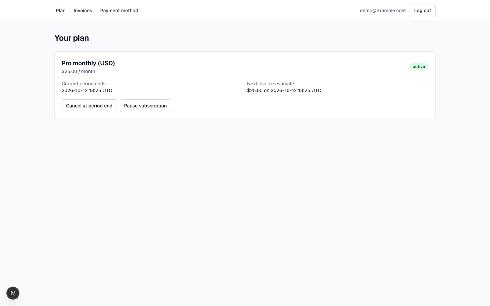
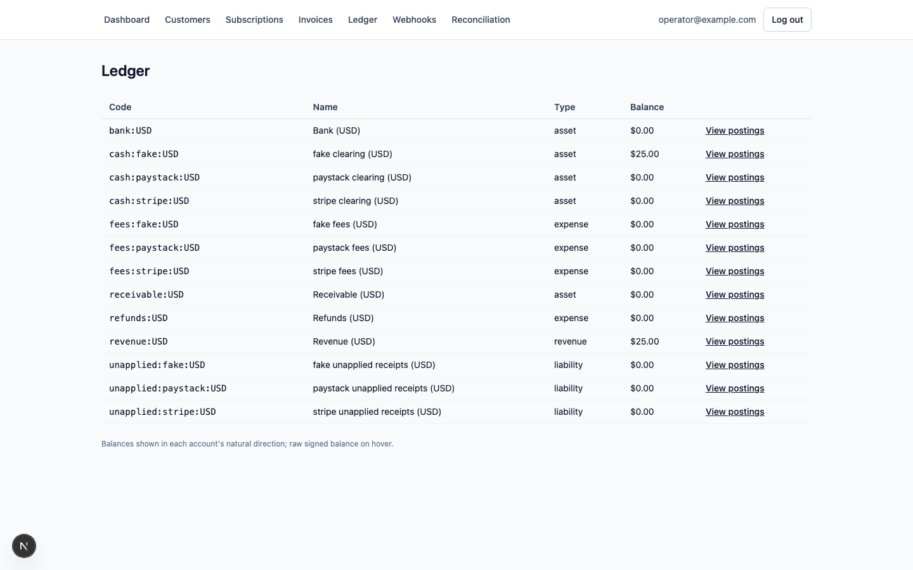

# billing-kit

Production-grade billing for Next.js and Postgres: Stripe and Paystack behind one interface, a double-entry ledger, webhooks that are safe to replay, dunning that does not lose customers, and the customer and admin screens every SaaS ends up building.

**Status:** 1.0 — Stripe and Paystack adapters, a double-entry ledger, replay-safe webhooks, reconciliation, subscriptions with proration and dunning, a customer portal, and an operator admin are all implemented and tested. See [Known unverified assumptions](#known-unverified-assumptions) for the handful of provider payload details not yet confirmed against a live test-mode event.

## Why

Every SaaS rebuilds the same four things badly: a provider integration, a ledger that is really a `balance` column, webhook handlers that double-charge on retry, and a dunning flow made of cron jobs and hope. billing-kit is one opinionated starter that gets those right once, in a stack most product teams already run, and charges in naira through Paystack or in dollars through Stripe from the same codebase.

## What is in the box (at 1.0)

- Customers, products, plans, subscriptions, one-off charges, invoices.
- Provider adapters: Stripe and Paystack, with hosted checkout for both (Monnify/Flutterwave are on the [roadmap](#roadmap)).
- A double-entry ledger: append-only entries and postings, zero-sum enforced in Postgres, balances derived, fees and settlements as their own postings.
- Webhook ingestion with idempotency keys and replay safety; reconciliation against provider settlements.
- Dunning: retry schedule, grace period, notification hooks, cancellation states.
- Customer portal and admin ledger explorer.
- Vitest and Playwright suites; deploy on Vercel and Neon.

## Stack

Next.js 15 (App Router, TypeScript strict), Postgres with Drizzle ORM, Tailwind CSS v4, Vitest, Playwright. MIT licence.

## Quickstart (local, fake provider)

**Prerequisites:** Node 22+, pnpm 10, Docker.

```bash
pnpm install
docker compose up -d          # Postgres on localhost:5433
cp .env.example .env
pnpm db:migrate
pnpm seed                     # demo product, plans, and a paid invoice for demo@example.com
pnpm dev
```

Open:

| URL | What |
| --- | --- |
| `/login` | Request a magic link for `demo@example.com` (portal) or `operator@example.com` (admin) |
| `/portal` | Customer plan, invoices, cancel/resume, payment method |
| `/admin` | Operator dashboard, ledger explorer, webhook log, reconciliation |

No email is sent locally: the default **console notifier** prints the magic-link URL to your `pnpm dev` terminal — copy it into the browser. `E2E_TOKEN_SINK` is a separate, test-only switch (used by the Playwright suite to read a login link from a file instead of the console) — leave it unset; **never set it in production**, since it would let anyone read another user's login link off disk.

## Architecture

```
Stripe / Paystack ──▶ /api/webhooks/[provider] ──▶ handlers ──▶ ledger (Postgres)
                                                        │
                                          subscriptions · invoices · dunning
                                                        │
        cron: dunning (hourly) · renew (daily) · reconcile (daily) · retry-webhooks (15m)
                                                        │
                                          portal (customer) · admin (operator)
```

Next.js App Router route groups: `(portal)` for customers, `(admin)` for operators, `api/webhooks/[provider]` for ingestion, `api/cron/*` for jobs. Everything reads and writes through `src/core` — providers only ever produce `NormalisedEvent`s; the ledger, subscriptions, and dunning modules never see a raw Stripe/Paystack payload. See `docs/superpowers/specs/2026-09-12-billing-kit-design.md` for the full design.

## Money model

Amounts are signed `bigint` minor units (kobo, cents) — never floats. **Debit is positive, credit is negative.** Every ledger entry's postings sum to zero per currency, enforced by a Postgres trigger; entries and postings are append-only (corrections are new, reversing entries). Idempotency keys (e.g. a provider event id, or `invoice:{id}:paid`) make replaying a webhook or retrying a mutation a no-op.

### Chart of accounts

`ensureChartOfAccounts` creates these accounts per currency, per configured provider (`stripe`, `paystack`, `fake`), idempotently:

| Code | Type | Purpose |
| --- | --- | --- |
| `cash:{provider}:{CUR}` | asset | Provider clearing: money a provider is holding for us before it settles to the bank. |
| `fees:{provider}:{CUR}` | expense | Fees a provider took, per-transaction or on settlement. |
| `bank:{CUR}` | asset | Our actual bank account, debited when a settlement lands. |
| `revenue:{CUR}` | revenue | Earned revenue. |
| `refunds:{CUR}` | expense | Contra-revenue: money returned to customers, its own account rather than reversing `revenue`. |
| `receivable:{CUR}` | asset | Amounts owed to us not yet collected (invoicing). |
| `unapplied:{provider}:{CUR}` | liability | A payment whose amount/currency didn't match the invoice it was meant to pay — held pending manual resolution, not revenue. |

**Resolving `unapplied:*` today:** when a provider reports collecting the wrong amount/currency for an invoice, billing-kit posts the receipt here (never loses it) and raises an `invoice_amount_mismatch` row in `reconciliation_flags` instead of guessing. There is no automated resolution flow yet (it's on the [roadmap](#roadmap)) — an operator investigates via `/admin/reconciliation` and `/admin/ledger`, then posts a correcting entry by hand with `postEntry`. Full detail, including every posting rule for webhooks and invoicing, is in [`src/core/ledger/README.md`](src/core/ledger/README.md).

## Providers

Run with no provider keys set at all and billing-kit uses the in-memory `fake` provider everywhere a live one would be needed (see `defaultProviderForNewSubscriptions` in `src/providers/registry.ts`) — that's what the Quickstart above does. Set the env vars below to bring a real provider online.

### Stripe

| Env var | Where it comes from |
| --- | --- |
| `STRIPE_SECRET_KEY` | Stripe dashboard → Developers → API keys |
| `STRIPE_WEBHOOK_SECRET` | The signing secret for the endpoint below (`whsec_...`) |

Webhook endpoint: `https://<your-domain>/api/webhooks/stripe`. Subscribe to:

- `checkout.session.completed`
- `invoice.paid`
- `invoice.payment_failed`
- `charge.refunded`
- `customer.subscription.updated`
- `customer.subscription.deleted`
- `payout.paid`

**Verify locally:** `stripe listen --forward-to localhost:3000/api/webhooks/stripe`, then `stripe trigger checkout.session.completed` in another terminal. A payment should land as a ledger entry (`cash:stripe:USD` debited, `revenue:USD` credited) — check `/admin/ledger`.

### Paystack

| Env var | Where it comes from |
| --- | --- |
| `PAYSTACK_SECRET_KEY` | Paystack dashboard → Settings → API Keys & Webhooks |

Webhook endpoint: `https://<your-domain>/api/webhooks/paystack`. Subscribe to (Paystack sends all events to one URL; billing-kit only acts on these):

- `charge.success`
- `invoice.payment_failed`
- `refund.processed`
- `subscription.create`
- `subscription.disable`
- `subscription.not_renew`
- `invoice.update`
- `transfer.success`

**Verify with a test-mode event:** Paystack dashboard → Settings → Webhooks → "Send Test Webhook" against your `/api/webhooks/paystack` URL (or an ngrok tunnel locally), then confirm the row appears in `/admin/webhooks` as processed.

### Known unverified assumptions

Both adapters are built from the providers' public docs and their fixtures, but a handful of payload details have not been confirmed against a real test-mode delivery. Nothing here blocks the fake-provider path or the tested fixture-based flows — these are the specific things worth double-checking before depending on them in production:

- **Stripe checkout/invoice fee expansion.** Fixtures model `payment_intent`/`invoice.payments[0].payment` as an object expanded three levels deep (`...latest_charge.balance_transaction`). Matches the installed SDK's types, but whether a real webhook delivery can actually be configured to expand that deep (vs. needing a follow-up API call) is unconfirmed.
- **Stripe `Invoice.payments`.** The "basil" API version replaced `Invoice.payment_intent` with `payments: ApiList<InvoicePayment>`; confirmed from the SDK's `.d.ts`, not from a live event.
- **Stripe settlement → payment matching.** `listSettlements` derives payment refs from `balanceTransactions.list({payout})[].source`, a Charge id (`ch_...`), while `payments.provider_ref` is a PaymentIntent id (`pi_...`). Fixtures make these line up on purpose; production reconciliation may need a charge→payment_intent lookup.
- **Stripe `charge.refunded` refund selection.** Prefers the refund newly added per `previous_attributes`, falling back to most-recently-created. Per Stripe's docs `previous_attributes` is only populated on `*.updated` events, so the diff path likely never fires for `charge.refunded` in practice — worth confirming.
- **Stripe subscription linkage fields** (`invoice.parent.subscription_details.subscription`, `invoice.lines.data[0].period`) used to match an invoice-linked payment by subscription+period — unverified against a live event. Stripe also documents both period bounds as inclusive, which doesn't match billing-kit's own period-start-inclusive/period-end-exclusive convention; left as reported rather than guessed at.
- **Paystack `providerEventId`.** Paystack webhooks carry no top-level event id; synthesized as `` `${event}:${data.reference ?? data.id}` `` — reasonable, but unverified against Paystack's actual redelivery semantics.
- **Paystack `invoice.payment_failed`, `refund.processed`, `transfer.success`, and subscription payloads.** Modeled from public docs/community references; field names like `data.transaction.reference` and the settlement summary's `total_amount`/`total_fees` are the parts most likely to drift from a real payload.
- **Paystack `/settlement` response shape**, including whether `currency` is present on every item — no official field-by-field schema published. Falls back to NGN with a `console.warn` if absent.
- **Resend's request/response shape** — kept to the minimal, documented `POST https://api.resend.com/emails` call; unconfirmed against a live Resend account.

## Jobs

Four cron routes, all requiring `Authorization: Bearer $CRON_SECRET` and responding to both `GET` (how Vercel Cron actually triggers them) and `POST` (for manual/local testing):

| Route | Schedule | Does |
| --- | --- | --- |
| `/api/cron/dunning` | hourly | Runs due dunning retry attempts, recovers or advances failing subscriptions. |
| `/api/cron/renew` | daily | Renews subscriptions whose period has ended. |
| `/api/cron/reconcile` | daily | Matches provider settlements to ledger entries, flags gaps. |
| `/api/cron/retry-webhooks` | every 15 minutes | Re-runs webhook events that failed transiently. |

Configured in [`vercel.json`](vercel.json). Run any of them locally:

```bash
curl -X GET http://localhost:3000/api/cron/dunning \
  -H "Authorization: Bearer $CRON_SECRET"
```

## Deploy (Vercel + Neon)

1. **Create a Neon database.** [neon.tech](https://neon.tech) → new project. Neon gives you two connection strings — a **pooled** one (`-pooler` in the hostname) and a **direct** one.
2. **Run migrations from your machine, against the direct URL:**
   ```bash
   DATABASE_URL="<neon-direct-url>" pnpm db:migrate
   ```
   (Pooled/PgBouncer connections don't reliably support the prepared statements a migration run needs — use the direct URL for this one step only.)
3. **Connect the repo to Vercel** (`vercel link` or import the repo in the dashboard), then set the project's environment variables — see the table below, but use the **pooled** `DATABASE_URL` here (the running app makes many short-lived connections; only the migration step needs the direct one). Add `CRON_SECRET` (`openssl rand -hex 32`) and whichever provider keys you're using.
4. **Deploy:** `vercel deploy --prod`, or push to the branch Vercel watches.
5. **Add the webhook endpoints** in the Stripe/Paystack dashboards, pointing at `https://<your-domain>/api/webhooks/{stripe,paystack}` (see [Providers](#providers) above for which events).
6. **Seed demo data (optional):** `DATABASE_URL="<neon-pooled-url>" pnpm seed`.
7. **Rotate secrets:** generate a new value and update it in Vercel's environment variables, then redeploy. There is no dual-secret grace period for `CRON_SECRET` in this release — cron calls made in the moment between generating the new secret and redeploying will 401 (the next scheduled run succeeds).

Vercel Cron reads the schedule from [`vercel.json`](vercel.json):

```json
{
  "crons": [
    { "path": "/api/cron/dunning", "schedule": "0 * * * *" },
    { "path": "/api/cron/renew", "schedule": "0 0 * * *" },
    { "path": "/api/cron/reconcile", "schedule": "30 0 * * *" },
    { "path": "/api/cron/retry-webhooks", "schedule": "*/15 * * * *" }
  ]
}
```

Vercel automatically sends `Authorization: Bearer $CRON_SECRET` on its own cron invocations once that env var is set.

### Environment variables

| Variable | Required | What |
| --- | --- | --- |
| `DATABASE_URL` | Yes | Postgres connection string (direct URL for migrations, pooled for the running app). |
| `CRON_SECRET` | Yes | Shared secret for `api/cron/*`; generate with `openssl rand -hex 32`. |
| `STRIPE_SECRET_KEY` | For Stripe | Stripe secret key. |
| `STRIPE_WEBHOOK_SECRET` | For Stripe | Signing secret for the Stripe webhook endpoint. |
| `PAYSTACK_SECRET_KEY` | For Paystack | Paystack secret key. |
| `RESEND_API_KEY` | No | Enables the Resend notifier; unset falls back to the console notifier. |
| `RESEND_FROM` | No | "From" address for Resend emails; defaults to `billing@example.com`. |
| `APP_URL` | No | Base URL for magic-link callback links; defaults to `http://localhost:3000`. |
| `OPERATOR_EMAILS` | No | Comma-separated emails granted an operator session; `pnpm seed` uses the first one. |
| `E2E_TOKEN_SINK` | No | Test-only; **never set in production**. |

## Testing

```bash
pnpm test         # Vitest, against Docker Postgres — pnpm db:migrate first if the schema has changed
pnpm test:e2e      # Playwright, against a built app (pnpm build && pnpm start) — migrates and seeds its own fixture
```

CI (`.github/workflows/ci.yml`) runs two jobs on every push and PR: `ci` (typecheck, lint, unit tests, build) and `e2e` (Playwright, with browsers installed fresh), each against its own Postgres service container.

## Security notes

- **Webhook signatures.** Stripe: `Stripe.webhooks.constructEvent` against `STRIPE_WEBHOOK_SECRET`. Paystack: HMAC-SHA512 over the raw body with `PAYSTACK_SECRET_KEY`, compared with `timingSafeEqual`. Both providers' raw body is read as text and verified *before* it is parsed as JSON.
- **Cron secret.** `Authorization: Bearer $CRON_SECRET` compared with `timingSafeEqual` behind a length guard (`src/core/cron-auth.ts`) — never a plain `===`. Rotation: see [Deploy](#deploy-vercel--neon) step 7 above; there is currently no overlap window between the old and new secret.
- **Session cookies.** Opaque, database-backed session ids (`bk_session`), `httpOnly`, `sameSite=lax`, `secure` in production, 30-day expiry, rotated on every login. No `SESSION_SECRET` — sessions aren't signed tokens, they're looked up.
- **Magic links.** 32 random bytes, SHA-256 hashed at rest (the raw token is never stored), 15-minute expiry, single use, rate-limited to 5 requests/email/hour. The raw link is redacted before it's written to the `notifications` table (`SENSITIVE_NOTIFICATION_KINDS`) — it only ever reaches the `Notifier` itself (console, Resend, or the test-only file sink).
- **PII.** Stored: customer emails, provider customer/subscription/charge references. Not stored: card numbers or any other card data — providers hold the instrument, billing-kit stores only their reference to it.
- **Database role.** The role the app connects as must **not** have `TRUNCATE` or trigger-disable privileges on `entries`/`postings` — `TRUNCATE` bypasses the row-level triggers that enforce append-only and zero-sum, silently erasing ledger history. Grant it `SELECT, INSERT` on those tables only; reserve `TRUNCATE`/trigger management for a separate, more trusted migration role. Full rationale in [`src/core/ledger/README.md`](src/core/ledger/README.md#operational-note-the-apps-database-role).
- **Found a vulnerability?** See [`SECURITY.md`](SECURITY.md) — please don't open a public issue.

## Roadmap

The full design is in [`docs/superpowers/specs/2026-09-12-billing-kit-design.md`](docs/superpowers/specs/2026-09-12-billing-kit-design.md). The milestones and their live checklists are in [`PLANS.md`](PLANS.md).

Post-1.0:

- Monnify and Flutterwave provider adapters.
- Provider-side plan sync on `changePlan` (today it updates billing-kit's own state only, not the live provider subscription's price).
- Invoice PDFs.
- Tax/VAT calculation.
- An in-app resolution workflow for `unapplied:*` receipts (today: manual, via `/admin/reconciliation` and a hand-posted correcting entry).
- Stripe/Paystack hosted billing-portal integration for updating a saved payment method (today `/portal/payment-method` is a placeholder — neither adapter implements a card-update session yet).

## Screenshots





## Author

Abdulsamii Ajala · [abdulsamii.com](https://www.abdulsamii.com) · jalasem@abdulsamii.com
